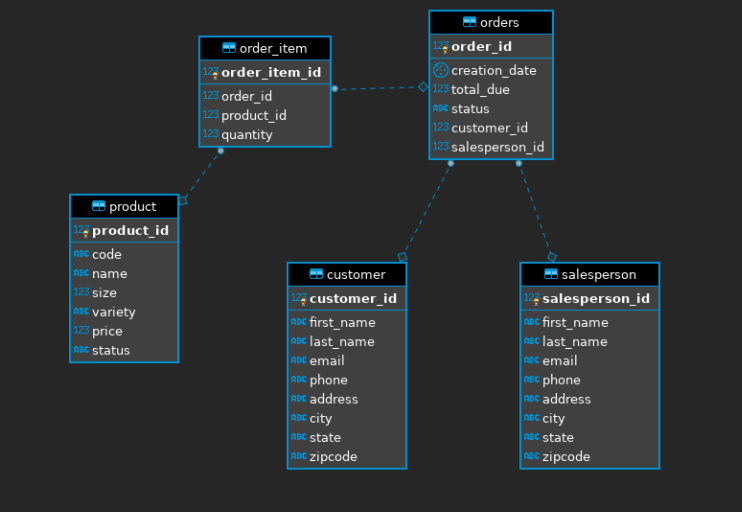

# Introduction

Java provides many powerful tools, many of which can be useful when manipulating relational databases. Java Database Connectivity (JDBC) acts as the bridge between the database, whether local or remote, and the Java application attempting to operate upon it. Creating this application was a learning exercise, which explored the basics of accessing a database, methods of abstracting data retrieval and how to complete database transactions.

# ER Diagram

# Design Patterns

When designing applications, we would like to decouple business logic from data access; allowing for cleaner more readable code, as well as improving code modularity. The two design patterns with which database access can be abstracted with: Data Access Objects(DAOs) and Repositories. Depending on your use case, one of these design patterns will be preferable to the other.

## Data Access Object (DAO)

These objects are able to a access data transfer object (DTO), which is modeled on the raw data stored within the database. The data returned within the DTO can be made up of a variety of related objects from various database tables, thus DAOs are required to be able to handle all of these different objects. 

- This design pattern shines when working with highly normalized datasets and vertically scaled systems, as it is able to perform complex joins when requested. 

## Repository

Repositories are used to access a single database table. This pattern exists at a higher level of abstraction than the DAO, as it interfaces directly with business objects (BO). These objects differ from DTOs in that they may contain logic in addition to raw data and are not retrieved from the database directly. The repository may be called on to fetch data, which the BO may perform operations on before sending the results to higher layers of the application. 

- This design pattern shines when working with horizontally scaled systems, as each node is able to return a single table at a time without having to work with the entire database.
- When working with non-normalized datasets this pattern isn't very helpful, as you would need to have a repository for all of the normalized tables.

