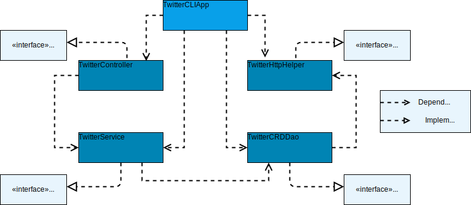

# Introduction

The social media platform Twitter is built upon a RESTful (*RE*presentational *S*tate *T*ransfer) API, which provides a uniform interface for applications to request and receive data in a common and agreed upon form. A simple Twitter This application was used as a means to learn about data persistence and its associated operations (CRUD), JSON de/serialization, REST APIs, MVC architecture and as a light introduction to Spring. 

# Design

This project employs the MVC (Model, View, Controller) design pattern, which breaks up the logic of an application into many different layers, allowing you to freely swap components depending on changes in requirements. Using this approach, the following UML diagram was created and implemented in Java:



-----

### TwitterCLIApp

An instance of this class is what users of the program will interface with directly. The user calls the command and provides additional arguments for the operation they desire. The CLIApp object will make a preliminary argument validity check, once passed it passes the arguments to the appropriate methods. This class is responsible for instantiating all of its dependencies, and their dependencies. 

### TwitterController

This class parses the user input and extracts the information that is required to perform the actual operation. This class depends on an object which implements Service, as this object will use the parsed input as arguments to be validated and manipulated before being sent to the server.

### TwitterService

This class is responsible for implementing the business logic of the application, and for ensuring the validity of the provided parameters prior to performing operations on them. This class depends on an object which implements CrdDao, as this object will take the validated and modified data from the Service and retrieve/send data to the server.

### TwitterCrdDao

The Twitter DAO (Data Access Object) class is responsible for properly forming the URIs required to perform the application's functions. The CRD in the class name stands for create, retrieve and delete; these operations are three of the four basic data persistence operations, the fourth being update, which is not compatible with tweets. This class depends on an object which implements HttpHelper, as this object will be in charge of actually transmitting requests and receiving data from the server.

### TwitterHttpHelper

This class implements the HttpHelper interface, meaning it is responsible for establishing a connection with the server and to use OAuth 1.0 in order to authenticate the user, so that they're able to execute POST and GET requests to the server. The user's credentials (consumer key, consumer secret, access token and token secret) must be stored as environmental variables in order for the user to be properly authenticated. In a Unix environment this can be done for the current instance with the following command line operations:

```shell
EXPORT consumerKey=ReplaceWithConsumerKey
EXPORT consumerSecret=ReplaceWithConsumerSecret
EXPORT accessToken=ReplaceWithAccessToken
EXPORT tokenSecret=ReplaceWithTokenSecret
```

# Quick Start

In order to package and prepare the application for usage the following commands can be run in project directory:

```shell
mvn compile
mvn package
java -jar target/ twitter-1.0-SNAPSHOT.jar [post|show|delete] [arguments]
```

#### Post

To make a status update, or tweet, the following command can be used:

``` post "text" "longitude:latitude"```

As a tweet cannot be made containing no text, the field "text" must not be empty. The body of the desired message must be placed within the quotation marks. Similarly, tweets cannot be created in locations where the latitude is outside of the range [-180°, 180°] and where the longitude is outside of the range [-90°, 90]. An example of a valid tweet is `post "This is my tweet's text! #newHere" "-43:65"`. When successful, the command will return the tweet object representing the tweet that was actually posted.

#### Show

To retrieve a particular tweet, and only display particular fields, the following command can be used:

``` show postId "fields, to, show"```

The field names the user enters must be a declared field of the Tweet class (Class signature found in the next section). An example of this operation being used correctly would be: `show 1207030702862217216 "id, text, favouriteCount, retweetCount"`. The operation will return the tweet with the given id and only display the id, text, favouriteCount and retweetCount fields and their values.

#### Delete

In the event of wanting to delete one or many tweets, the following command can be used:

`delete postId1 ... `

The command requires at minimum a single tweet id, but in the case of wanting to delete more than one, they can be listed as: `delete postId1 postId2 postId3`. When successfully used, the command will return a list of the deleted tweets.

# Model


---

Twitter details their Tweet class on their developer page, for this project I created a simplified version of the class. The fields of greatest importance were those required to create a valid tweet according the the criteria of having a valid id, a non-empty text message and a sane location. 

# Improvements

- Expand the model to be closer to a true Twitter Tweet, rather than having a limited Tweet class.
- Improve the readability of the code used at each layer of the application.
- Improve the performance of the various methods at play during the applications operation.