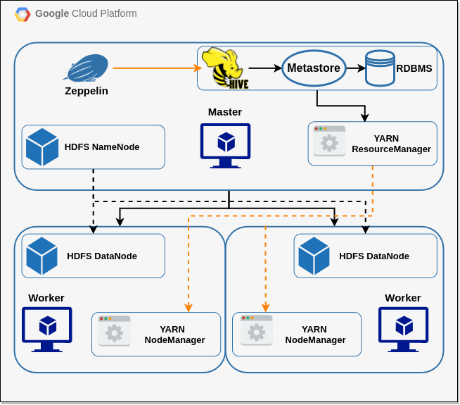
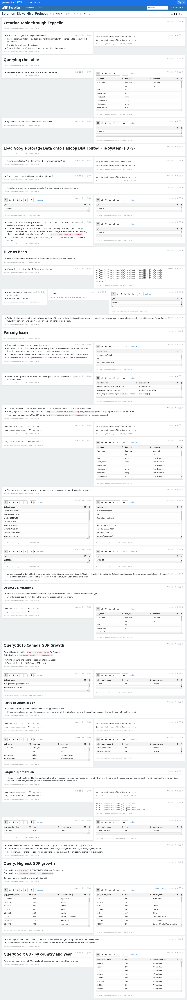

# Hadoop Project

#### Table of contents

* [Introduction](#Introduction)
* [Hadoop Cluster](#Hadoop_Cluster)
* [Big Data Tools](#Big_Data_Tools)
* [Hardware Specifications](#Hardware_Specifications)
* [Hive Project](#Hive_Project)
* [Improvements](#Improvements)

# Introduction

The goal of this project was to provision a Google cloud platform (GCP) machine cluster in order to become familiar with the *Hadoop* ecosystem. As part of my exposure to *Hadoop*, I learned about and worked with big data tools such as *HDFS* (Hadoop distributed file system), *Apache Hive*, *YARN* (Yet another resource negotiator) and *MapReduce*. An *Apache Zeppelin* notebook was used to organize and perform a variety of HiveQL queries on data from the World Bank's 2016 World Development Indicators table. 

# Hadoop Cluster

In order to take advantage of distributed computing, I provisioned a cluster of three machines from *GCP Dataproc*. One of these machines is set as the master node, while the other two are worker nodes.

## Big Data Tools

### MapeReduce

*MapReduce* is a distributed programming model where data is converted into key-value pairs within a map, and after intermediate computations, are reduced from a map into the expected result. As part of the intermediate computations, the map is split amongst a number of mappers, which all operate on their share of the map and returned as output maps. Once the mappers are finished with their jobs, the maps are all sent to a single reducer, which takes this intermediate maps and performs the final mapping. The final mapping returns data in the form requested by the initial job. For example, a word count *MapReduce* job would read in a text file, and return a set of unique words and their counts within the document.

### YARN (Yet another resource negotiator)

*YARN* distributes resources when there are jobs, *MapReduce* jobs or otherwise, requesting them. The *ResourceManager* is located on the master node and is responsible for keeping track of running jobs and the resources allocated to them, as well as the free resources that can be allocated to new ones. Each node contains a *NodeManager*, and every application/job being run requires it's own *ApplicationMaster*.

### Hadoop Distributed File System (HDFS)

*HDFS* creates a unified file system interface when interacting with a distributed system. The master node, also known as the *NameNode*, manages metadata for the cluster and delegates to the worker nodes, also known as *DataNodes*. The data stored in the *DataNodes* are stored in 128MB block if and only if the files are larger than 128MB. To ensure redundancy, each block of data is stored three times in a distributed fashion.

### Apache Hive

*Hive* provides a front similar to a relational database management system for the cluster, allowing those with *SQL* experience to work with data within the *HDFS*, without having to have strong programming skills. *Hive's* compiler parses the provided *SQL* and the *Hive* execution engine is responsible for executing the appropriate methods. When first working with *Hadoop*, *Beeline*, a command-line interface for *Hive* was used.

### Apache Zeppelin

*Zeppelin* is a web UI for interacting with a variety of programming languages and data processing back-ends. For this project, *Zeppelin* provides a way to apply markdown to easily and cleanly display *HiveQL*, bash commands and their associated outputs. Once created, the notebook can be freely shared with others.

### Hardware Specifications

All machines within the cluster, the master and two workers all share the following specifications:

- 2 vCPUs
- 12 GB RAM
- 100 GB storage

# Hive Project

- I began the project by provisioning the cluster from *GCP Dataproc* and specified the machine specifications required as well as connecting Apache Zeppelin to the cluster. 
- *The World Development Indicator (WDI)* 2016 dataset was found and saved as a *CSV* (Comma-separated value) file on the cluster by importing it from *GCP BigQuery*. The file was split based on the block size of the *HDFS*, which lead to multiple file parts. 
- I then connected to the cluster's master node through *SSH (secure shell)* via the *GCP* interface. Once connected, I ran the *Apache Beeline* tool and began by creating a table for the *WDI* data. 

*The steps following this are all written in my *Zeppelin* notebook, a full-page screenshot of which can be found below:*

# Improvements

Granted more time, the following improvements could be made:

- Optimize *HiveQL* queries to be more performant, try formats other than *parquet* to verify performance in particular situations.
- Improve the readability of my *Zeppelin* notebook, based on feedback.
- Refine my descriptions of the tools used in this project to be more descriptive and concise.
