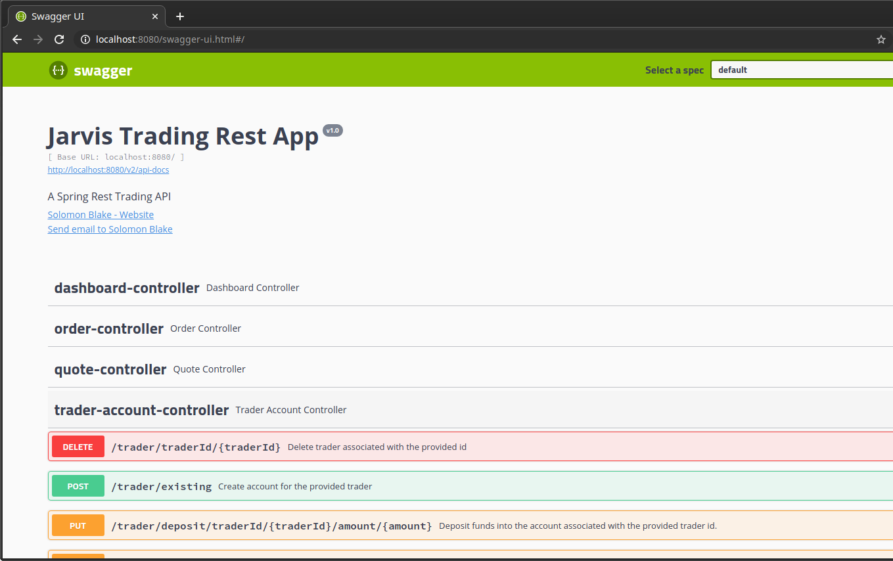

# Table of contents

* [Introduction](#Introduction)
* [Quick Start](#Quick-Start)
* [Architecture](#Architecture)
* [REST API Usage](#REST-API-Usage)
* [Docker Deployment](#Docker-Deplotment)
* [Improvements](#Improvements)

# Introduction

---
With the ability to access real-time market data through IEX Cloud, I created an online stock trading application which can be accessed through its REST API. Using this application, a trader can create their trading account, find the latest stock prices, post their own market orders and manage their stock positions. By leveraging Spring Boot, this microservice can access live market data from the IEX Cloud API and store/retrieve data in a <u>P</u>ostgre<u>SQL</u> (PSQL) database; it is being deployed using Docker.

# Quick Start

---
- Prerequisites: Docker, CentOS 7
- Run the commands below to get started:
	- Build both the PSQL and Trading application docker images and verify their existence:

    ``` shell
    cd ./psql
    docker build -t trading-psql .
    docker image ls -f reference=trading-psql
    ```

    ``` shell
    cd ..
    docker build -t trading-app .
    docker image ls -f reference=trading-app
    ```

	- Create the docker network required for the containers and verify its existence:
    ``` shell
    docker network create trading-netw
    docker network ls
    ```
	  
  - Start containers using data from the environment (`export POSTGRES_USER=postgres  `).
    
    ``` shell
  docker run --name trading-psql -e POSTGRES_PASSWORD=${POSTGRES_PASSWORD} -e POSTGRES_DB=${POSTGRES_DB} -e POSTGRES_USER=${POSTGRES_USER} --network trading-net -d -p 5432:5432 trading-psql
  docker container start trading-psql
    ```
    
    ``` shell
    docker run --name trading-app -e PSQL_URL=jdbc:postgresql://trading-psql:5432/${POSTGRES_DB} -e POSTGRES_USER=${POSTGRES_USER} -e PSQL_PASSWORD=${POSTGRES_PASSWORD} -e IEX_PUB_TOKEN=${IEX_PUB_TOKEN} --network trading-net -p 8080:8080 -t trading-app
    ```

The Swagger UI for the trading application can be access from this here: http://localhost:8080/swagger-ui.html#/

# Architecture

---


### Controller Layer
Controllers are used to parse user input and direct the data to the appropriate services. REST API endpoints are defined by these controllers.

### Service Layer
Services are responsible for taking the input they receive from the Controllers, which it then performs business logic on. They interface with the various data layer objects in order to provide what was requested by the controller.

### Data Layer

Data Access Objects (DAOs) are responsible for retrieving and persisting data from a DataSource, in this project the database connection is managed by <u>J</u>ava <u>D</u>ata<u>B</u>ase <u>C</u>onnectivity (JDBC). 

### Spring Boot
Spring Boot simplifies the use of the Spring Framework, allowing microservices to be created and configured much more quickly. Spring Boot, and Spring more generally, are used for <u>I</u>nversion <u>o</u>f <u>C</u>ontrol (IoC). IoC simplifies and automates working with multiple, and possibly nested dependencies between components. It also includes Apache Tomcat, a WebServlet, which is used by the microservice to handle requests. 

### PostgreSQL (PSQL)
Data persistence is key to storing and maintaining trader data, whether it be their personal information, accounts or orders. A PSQL container is deployed and connected to the trading application.

### IEX Cloud API

IEX Cloud hosts real time stock market data on their servers and provide an easy to use RESTful API, which is used to access said data.

# REST API Usage

---

## Swagger



Swagger is a suite which provides a variety of open source tools, all of which allow users to visualize and consume application REST APIs easily. While there are other more direct ways to consume these APIs, Swagger opens up the ability to interact with these systems to a wider demographic, including those who have little to no technical training. The link to access the trading application's Swagger UI is: http://localhost:8080/swagger-ui.html#/.

## Quote Controller

User input is used to access endpoints which allow for the saving and display quotes, retrieve the most up to date stock quote data, and list the quotes they've chosen to save:

- GET `/quote/iex/ticker/{ticker}`: Show latest market data for particular stock symbol/ticker.
- PUT `/quote/iexMarketData`: Update quote table information using the latest IEX Cloud market information.
- PUT `/quote/update`: Update a particular quote.
- PUT `/quote/tickerId/{tickerId}`: Add quote to the Quote table of the database.
- GET `/quote/dailyList`: List all quotes currently saved in the database.

## Trader Controller

User input is parsed and used to create new trading accounts, make deposits or withdrawals and delete trading accounts:

- POST `/trader/firstname/{firstname}/lastname/{lastname}/dob/{dob}/country/{country}/email/{email}`: Create a new trader account using their personal information.
- POST `/trader/existing`: create a new trader account for the provided trader.
- DELETE `/trader/traderId/{traderId}`: Delete trader with the corresponding traderId, if and only if the trader has no opened positions, and their account has a balance of $0.00.
- PUT `/trader/deposit/traderId/{traderId}/ammount/{amount}`: Deposit funds into the trader's account, if and only if the amount is greater than $0.00.
- PUT `/trader/withdraw/traderId/{traderId}/ammount/{amount}`: Withdraw funds from the trader's account, if and only if the amount is less than or equal to the current balance and greater than $0.00.

## Order Controller

User input is used to create market orders:

- POST `/order/marketOrder`: Make a market order with the provided order; works for both buy and sell orders.

## DashboardController

This controller is used to display trader information in an easy to read format:

- GET `/dashboard/profile/traderId/{traderId}`: Show trader information alongside their account information for the trader with the provided id.
- GET `/dashboard/portfolio/traderId/{traderId}`: Show trader portfolio for the trader with the provided id.

# Docker Deployment
---
While briefly shown in the [component diagram](# Architecture) and in the [quick start](# Quick Start) section, there is more to how docker is used to deploy microservices. When built, the images that are created are made based on the content of the relevant Dockerfile. Both of the files used to build our application and database reference various images, which are pulled from the Docker Hub and use as the files foundation. Below is a diagram showing how Docker interacts with the microservice, from the creation of the image, to deployment:


As seen below, both Maven and OpenJDK are being pulled and being used as part of the Trading application's image. Maven, a project management tool, is responsible for retrieving the dependencies required (pointed to by the pom.xml file in line 3)) for the application's Java code to run. Maven is then used to clean and package the application in a jar file which is referenced later.

``` Trading App Dockerfile 
FROM maven:3.6-jdk-8-slim AS build
COPY src /build/src
COPY pom.xml /build/
RUN mvn -f /build/pom.xml clean package -DskipTests

FROM openjdk:8-alpine
COPY --from=build /build/target/trading-1.0-SNAPSHOT.jar /usr/local/app/trading/lib/trading_app.jar
ENTRYPOINT ["java","-jar","/usr/local/app/trading/lib/trading_app.jar"]
```
In the case of the PSQL Dockerfile, it uses `COPY` to include the database initialization script, which is included when the docker image is built.
``` PSQL Dockerfile
FROM postgres:9.6-alpine
COPY ./sql_ddl/schema.sql /docker-entrypoint-initdb.d
```

Relevant keywords found within Dockerfiles:
- `FROM`: Pulls a particular image from the Docker Hub, a central repository where many applications images are available. 
- `COPY`: Copy and include particular files or directories within image for use in application building or initialization.
- `RUN`: Execute particular commands relevant for the particular image.
- `ENTRYPOINT`: The command which will flag the application as executable.

# Improvements

---
As with any project, there is always room for improvement, here are a few things that I could improve:

- Include more advanced trading functionality.
- Additional revisions would be made to documentation for those who would want to use this as part of their own projects.
- In order to improve troubleshooting, logging should be added in earnest.
- If required, a more sophisticated front end could be developed for a general audience.
- There are likely method implementations that could be streamlined for readability and performance.
